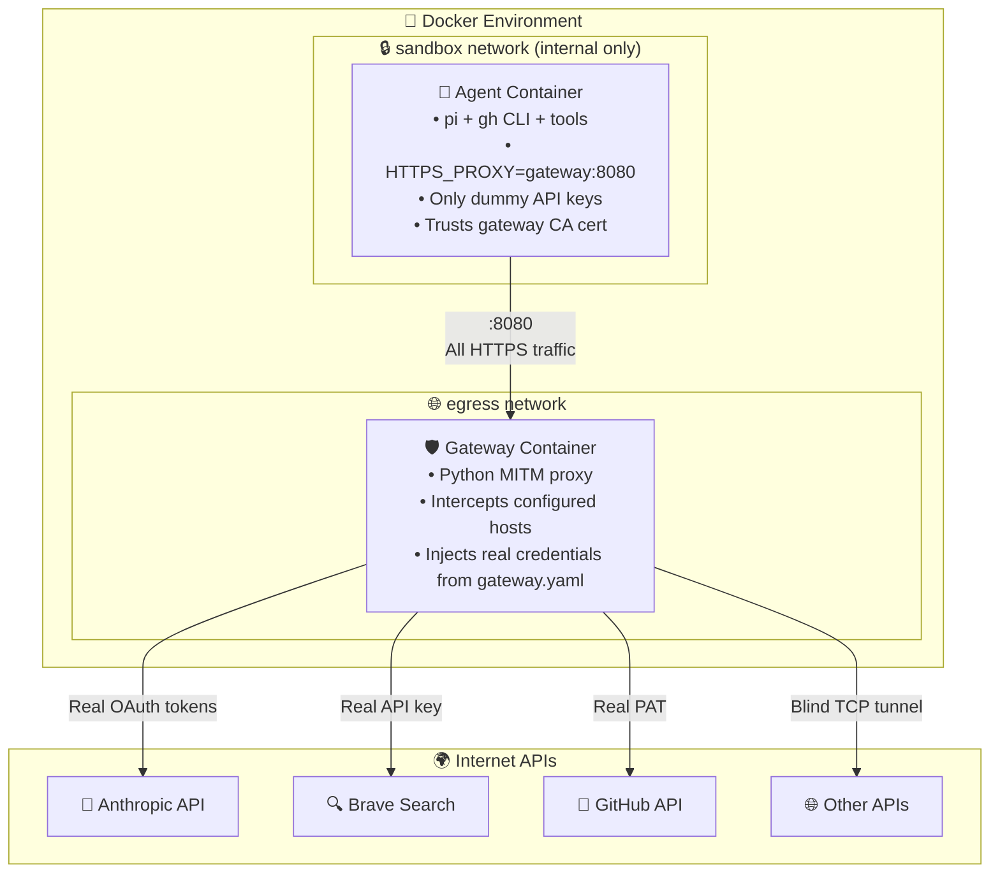

# Truman

**Sandboxed [pi](https://github.com/badlogic/pi-mono) agent runtime with credential injection.**

Truman provides a set of containers that give any project a secure, sandboxed AI coding agent. It complies with the [devcontainer specification](https://containers.dev), so it works with VS Code, the `devcontainer` CLI, GitHub Codespaces, and any other devcontainer-compatible tool.

- 🔒 **Agent never sees real API keys** — gateway injects credentials transparently
- 🌐 **Network isolation** — agent cannot access internet directly, only through MITM proxy
- 🔄 **Auto-refreshing tokens** — OAuth tokens refresh automatically
- 📁 **Works on any project** — drop `.devcontainer/` into your repo and go

## Quick Start

### Prerequisites

- Docker Desktop
- [pi](https://github.com/badlogic/pi-mono) installed on the host (for OAuth login)
- For VS Code: [Dev Containers](https://marketplace.visualstudio.com/items?itemName=ms-vscode-remote.remote-containers) extension
- For CLI: `npm install -g @devcontainers/cli` (optional)

### Add truman to your project

```bash
# 1. Copy the template into your project
cp -r template/.devcontainer/ /path/to/your-project/.devcontainer/

# 2. Run the interactive setup wizard
cd /path/to/your-project
.devcontainer/truman.sh init

# 3. Start the devcontainer
.devcontainer/truman.sh start
```

See the **[devcontainer README](template/.devcontainer/README.md)** for full usage instructions covering VS Code, the devcontainer CLI, docker compose, multi-container setups, and customization.

## Architecture



### How It Works

1. **Agent** sends all HTTPS requests with dummy API keys through `HTTPS_PROXY` to the gateway
2. **Gateway** intercepts HTTPS traffic for configured hosts (Anthropic, Brave, GitHub) via MITM
3. Gateway strips dummy credentials and injects real ones from `gateway.yaml` before forwarding
4. For non-configured hosts, gateway performs blind TCP tunneling (no credential injection)
5. Agent runs on internal-only network — all traffic must go through gateway
6. Gateway automatically refreshes OAuth tokens proactively and reactively on 401 responses

### Credential Flow

| Service        | Agent sees              | Gateway injects            |
|----------------|-------------------------|----------------------------|
| Anthropic API  | `sk-ant-oat01-DUMMY...` | Auto-refreshed OAuth token |
| Brave Search   | `BSAdummy...`           | Real `BRAVE_API_KEY`       |
| GitHub API/git | `ghp_DUMMY...`          | Real `GH_TOKEN`            |

## Project Structure

```
truman/
├── images/
│   ├── gateway/          # MITM credential-injection proxy
│   │   ├── Dockerfile
│   │   ├── gateway.py
│   │   ├── pyproject.toml
│   │   └── uv.lock
│   └── agent/            # Pi coding agent container
│       ├── Dockerfile
│       └── entrypoint.sh
├── template/             # Copy .devcontainer/ into your project
│   └── .devcontainer/
│       ├── README.md
│       ├── devcontainer.json
│       ├── docker-compose.yml
│       └── truman.sh
├── examples/
│   └── temperature-converter/
└── docs/
```

## Container Images

Published to GitHub Container Registry:

| Image                                | Purpose                              |
|--------------------------------------|--------------------------------------|
| `ghcr.io/sayreblades/truman-gateway` | MITM proxy with credential injection |
| `ghcr.io/sayreblades/truman-agent`   | Pi coding agent with tools           |

## Devcontainer Compliance

Truman uses the [docker-compose variant](https://containers.dev/implementors/json_reference/) of the devcontainer spec:

- `devcontainer.json` → `"dockerComposeFile"` + `"service": "agent"`
- Works with VS Code Dev Containers extension
- Works with `devcontainer` CLI (`devcontainer up`, `devcontainer exec`)
- Works with GitHub Codespaces
- Works with DevPod

## Development (building truman itself)

```bash
make build          # Build gateway + agent images locally
make publish        # Push images to ghcr.io
make clean          # Remove locally-built images
```

## Design Documents

- [Architecture plan](docs/plan.md)
- [Phase 1: Docker container](docs/plan-phase-1.md)
- [Phase 2: Secret gateway + network isolation](docs/plan-phase-2.md)
- [Generalized auth configuration](docs/plan-auth.md)
